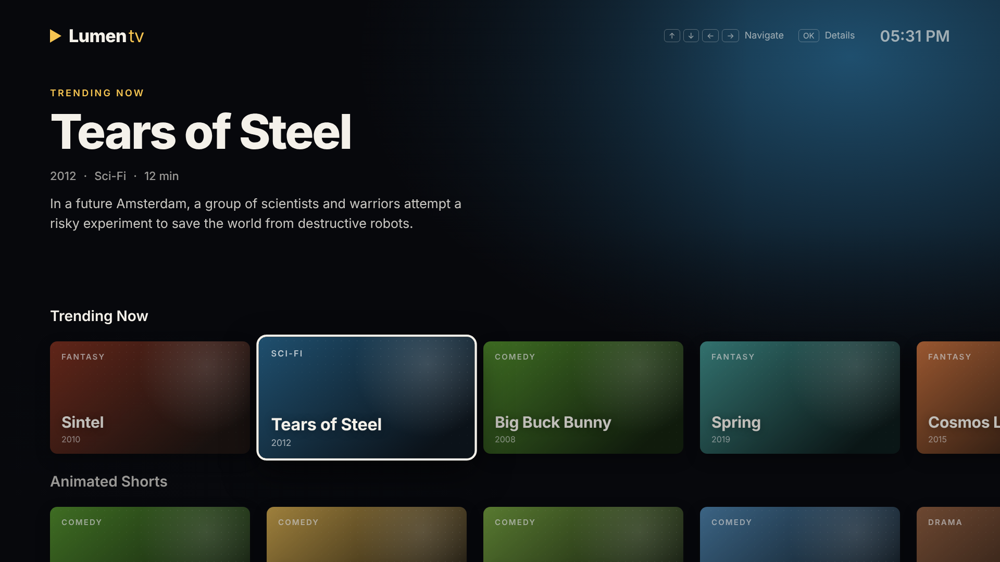
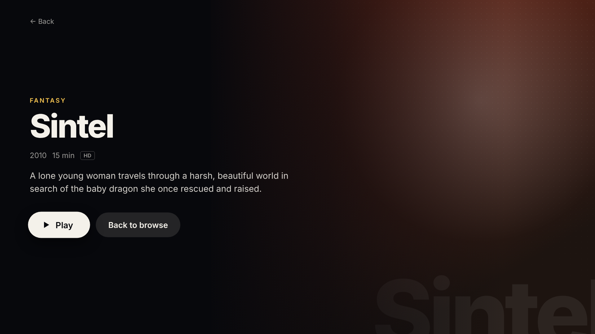
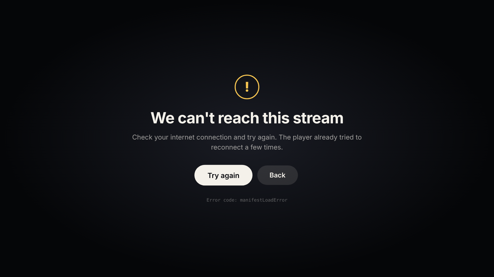

# Lumen TV

A Smart TV-style streaming app built with React and TypeScript. Everything is controlled with a remote: arrow keys, OK and Back. No mouse needed.

**Live demo:** _add your Vercel link here_



## Features

- **Remote-control navigation.** Arrow keys move focus across rows and cards, OK opens details, Back returns. Each row remembers its last focused card, and the rows scroll smoothly to keep the focused card in view.
- **TV key support.** Handles Samsung Tizen (`10009`) and LG webOS (`461`) Back keys and media Play/Pause keys, as well as keyboard input in the browser.
- **Dynamic hero banner.** The banner updates with the focused title, with an animated color backdrop.
- **HLS video player** built on [hls.js](https://github.com/video-dev/hls.js), with native HLS fallback for Safari:
  - Play/pause, 10-second seek and a progress bar
  - Controls that hide automatically during playback
  - Live stream detection with a LIVE badge (seeking is disabled for live)
- **Player error handling**
  - Network errors trigger automatic reconnects with exponential backoff (1s, 2s, 4s), resuming from the last position
  - Media errors get one `recoverMediaError()` attempt before failing
  - A friendly error screen with Try again and Back, plus the technical error code for debugging
- **1920×1080 layout** that scales to fit any screen while keeping its proportions.
- **Code-split player.** hls.js loads only when playback starts.

## Screens

| Details | Player error handling |
| --- | --- |
|  |  |

## Controls

| Key | Action |
| --- | --- |
| ↑ ↓ ← → | Move focus / seek ±10s in the player |
| Enter (OK) | Select / play-pause |
| Space | Play-pause |
| Backspace / Esc / TV Back | Go back |

## Tech stack

React 19 · TypeScript · Vite · hls.js · CSS Modules. No UI libraries.

## Project structure

```
src/
  components/
    Stage.tsx      1920×1080 canvas scaled to the window
    Home.tsx       Hero banner + rows with focus management
    Card.tsx       Title card
    Details.tsx    Title details with Play / Back
    Player.tsx     HLS player, controls and error handling
  data/movies.json Catalog and rows
  useKeys.ts       Keyboard and TV remote key mapping
```

## Run locally

```bash
npm install
npm run dev
```

Build for production with `npm run build`.

## Content

Titles are open movies by the [Blender Studio](https://studio.blender.org/films/), released under Creative Commons licenses. Playback uses public HLS test streams (Mux, Unified Streaming, Bitmovin, Apple, Akamai), so some titles share a stream. The **Stream Test Lab** row includes a live stream and a deliberately broken stream to demonstrate the player's error handling.
